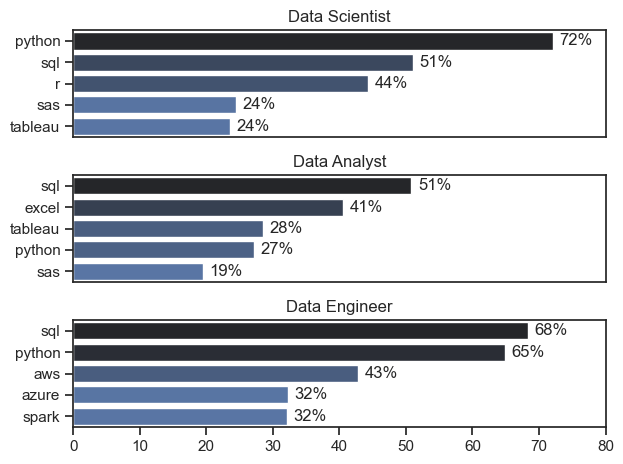
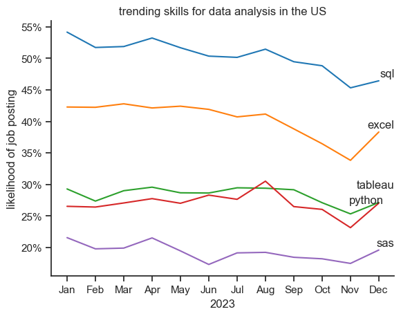
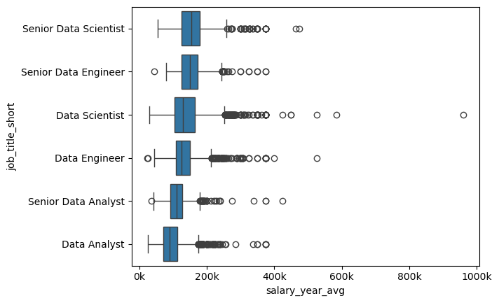
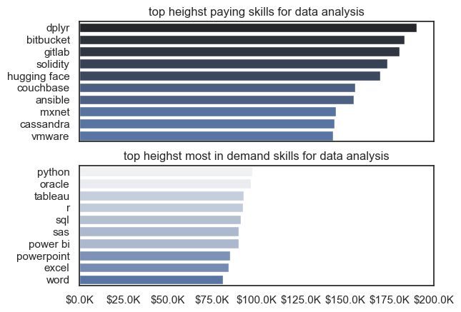

# The Analysis

## 1. What are the most demanded skills for the top 3 popular data roles?
 
To find the most demanded skills for the top 3 most popular data roles. I filtered out those positions by which ones were the most popular, and got the top 5 skills for those top 3 roles. This query highlights the most popular job titles and their top skills, showing which skills I should pay attention to depending on the role I'm targeting.

### result

## key insights:

1. SQL and Python are the Core Cross-Role Skills

Across all three roles, SQL and Python appear consistently among the most demanded skills. SQL is the #1 skill for both Data Analysts (51%) and Data Engineers (68%), while Python dominates Data Scientists (72%) and remains highly valued for Data Engineers (65%). This suggests that mastering SQL and Python provides the strongest foundation and career flexibility across the entire data ecosystem.

2. Each Role Has a Distinct Specialization Layer

While there is overlap, each role requires additional domain-specific tools:

Data Scientists emphasize statistical and analytical programming (R, SAS) alongside Python.
Data Analysts focus more on business reporting and visualization tools (Excel, Tableau).
Data Engineers prioritize cloud and big-data technologies (AWS, Azure, Spark).
This reflects the progression from analyzing data → modeling data → building data infrastructure.
3. Data Engineering and Data Science Are More Technical Than Data Analysis

The skill profiles show that Data Engineers and Data Scientists rely heavily on programming and technical platforms, whereas Data Analysts depend more on reporting and visualization tools. For someone planning a long-term transition toward AI/ML, the strong emphasis on Python, SQL, cloud technologies, and big-data tools in Data Science and Data Engineering suggests these paths are more directly aligned with advanced machine learning careers than a traditional analyst-focused toolkit.

## 2. What are in-demand skills trending for data analysis

bar graph for the trending job skills 

## insight:
1. SQL remains the top skill throughout the year, consistently highest (~45–55%), though it shows a slight decline toward the end.
2. Excel demand drops significantly mid–late year, falling from ~42% to ~34% before a small recovery in December.
3. Python and Tableau stay relatively stable, but Python spikes noticeably around August, briefly overtaking Tableau.

## 3. How will jobs and skills pay for data analysts?

